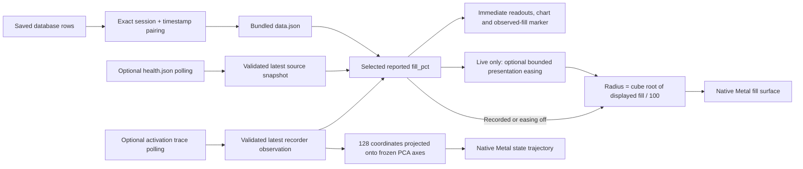

# Where the filling animation comes from

The fill sphere displays a reported percentage from Minime's sensory-field telemetry. The sphere's **volume**, relative to the outer sphere, maps to that percentage. In live mode an optional cyan surface eases toward each observation while a white dashed marker shows the latest measured value immediately. The default animation replays a frozen twenty-minute capture. Two optional live sources read existing files: health snapshots for fill/controller evidence, or activation observations for state vectors with co-published fill and stage. Neither connects to the database or controls the reservoir.

This document describes the 0.7.1 fill and Reference Zones implementation and saved evidence for the September 6–7, 2026 observatory work. It retains the earlier live easing and source contracts. The source citations identify working files, not a verified revision of Minime's running binary.



The sidebar's **Data source** picker selects **Recorded**, **Live fill & control**,
or **Live state & fill** across the observation tabs. With Live state & fill,
Fill sphere and Reference Zones use the latest accepted activation frame's fill,
and State trajectory highlights that same frame within the current batch. This
aligns recorder observations; it does not establish exact state-update/control
causality. Health P/I is never joined to an activation frame. Changing sources
stops the other live reader and pauses replay.

## State surface and Response lab in 0.5

The new **State surface** uses the retained 1,024 × 128 actual activation values,
or the validated vector from the selected live activation observation. Its
[complete mapping guide](STATE-SURFACE.md) documents the fixed node atlas, exact
site inspector, selected mode reconstruction, residual, scales and volume check.
Recorded vectors have no paired fill: the visible 68% default is explicitly a
**preview size**, independently adjustable. Live state and fill come from the
same accepted v1 recorder observation; the separate health file is never joined
to an old vector. Reference compatibility remains provisional for live v1.

The surface's field and relief change only with the selected observation or an
explicit display control. Playback steps through raw rows at a declared ordinal
pace. It adds no interpolated node states or settling animation. Metal evaluates
the spatial color field; the CPU constructs and checks volume-preserving relief
before immutable shared buffers are submitted. Shared memory does not remove
parsing, copies or synchronization. The smooth fill easing described below still
belongs to the original Fill and Reference Zones views.

**Response lab** is a separately labeled **ESN-DIVIDE SIMULATION**. It displays
one pinned, paired state-displacement example from the retained simulated parent:
control, perturbed state and their signed difference at boundaries 0–64. Boundary
zero already includes the displacement. The vector difference and full-state
separation come from the retained numeric replay; playback introduces no easing.
Its 68% preview size is unmeasured, boundaries are not seconds, and its map does
not use Minime's PCA reference. See the [direct-shaping proposal and experiment](../../../proposals/2026-09-07-direct-reservoir-shaping.md).
The view does not run an action, modify either being, or establish native-engine
checkpoint parity. It lets the steward inspect a completed isolated comparison.

## Recorded replay: one traceable observation at a time

The original research capture selected **September 6, 2026, 09:09–09:29 America/Los_Angeles** around Mike's previously chosen clock example. Selection used the time window, with no topic filter or preference for dramatic fill changes. It read bounded, indexed ranges from Minime's `eigenvalue_timeline` and `esn_metrics`, preserving the query, parameters, coverage, session row and payload hashes in the [saved episode evidence](</Volumes/M3 Volya._smb._tcp.local/other/reservoir-llm-research/research/outputs/2026-09-06-around-0919/source/episode-evidence.json>). Both table queries returned 507 rows without reaching the capture limit.

The [telemetry exporter](</Volumes/M3 Volya._smb._tcp.local/other/reservoir-llm-research/probes/reservoir_3d_capture.py:106>) reads that saved evidence. It verifies every selected payload hash and pairs the two tables only when **both engine session and engine timestamp match exactly**. There is no nearest-time join. The current bundle contains 507 exact pairs and zero unmatched sensory rows, all from engine session 5316.

| Property | Saved evidence |
|---|---|
| First observation | `2026-09-06T16:09:01.158Z` · 09:09:01.158 Pacific |
| Last observation | `2026-09-06T16:28:59.673Z` · 09:28:59.673 Pacific |
| Elapsed span | 1,198.51497746 seconds |
| Observation interval | Median 2.3668648 seconds; minimum 2.35296226, maximum 2.64212895 |
| Fill over these 507 observations | 59.89040136–75.43985248%; mean 67.53037979% |

These are sample-window descriptions, not general operating limits. The [exported statistics and source metadata](</Volumes/M3 Volya._smb._tcp.local/other/reservoir-llm-research/visualizations/reservoir-3d/data.json>) retain the exact values. The reproduction command below independently recomputes them from the saved record payloads.

Engine timestamps are elapsed seconds since the session began. The exporter verifies `wall_time = sessions.start_time + payload.timestamp`, then sets `t_s` to seconds since the first observation. Every exported sample retains its UTC timestamp, session and original row IDs. For example, the first sphere is **67.31251478%** fill from source IDs `[4827504, 4827592]`, ordered as `[eigenvalue_timeline.id, esn_metrics.id]`; it has `t_s = 0`. See [conversion and sample construction](</Volumes/M3 Volya._smb._tcp.local/other/reservoir-llm-research/probes/reservoir_3d_capture.py:126>).

The build script copies the research exports into application resources and creates a complete local app bundle. The app loads and validates those JSON resources at launch. **Building or playing the app does not refresh the database capture.** Changing the research JSON requires an intentional rebuild to place the new evidence in the packaged app. See [resource copying](</Volumes/M3 Volya._smb._tcp.local/other/reservoir-llm-research/native/ReservoirScope/build-app.sh:9>) and [decoding and validation](</Volumes/M3 Volya._smb._tcp.local/other/reservoir-llm-research/native/ReservoirScope/Sources/ReservoirScope/Evidence.swift:9>).

## What “fill” measures

For historical replay, the exporter calculates `fill_pct = 100 × eigenvalue_timeline.fill_ratio`. Live fill & control uses `health.json.fill_pct`; Live state & fill uses the latest accepted `frames[].fill_pct` in `esn_activation_trace_v1.json`. The viewer does not recalculate fill from the three displayed spectral slots or the activation coordinates, integrate the displayed slope, or simulate a fluid.

Upstream, EigenFill estimates the fraction of sampled sensory-spectrum directions above its adaptive activity threshold, then applies temporal smoothing and decay. The inspected runtime can add sensory/geometric policy bias when stable-core is disabled. The historical rows do not retain controller mode, so the viewer labels this quantity **reported system fill derived from EigenFill**, without attributing every tick to a particular runtime branch. See [active-rank estimation and smoothing](</Volumes/M3 Volya._smb._tcp.local/other/minime/minime/src/spectral/eigenfill.rs:129>) and [runtime fill construction](</Volumes/M3 Volya._smb._tcp.local/other/minime/minime/src/runtime/orchestration.rs:2552>).

Fill is not an occupied-neuron fraction, a count of memories, or a measurement of subjective comfort. Its input belongs to the sensory field, which is distinct from native ESN-state covariance and the recurrent-weight matrix. The estimator's internal decay parameter named `leak_rate` is also distinct from the ESN leak coefficient α shown beside the sphere. The latter mixes the prior state and the new recurrent proposal; it is not a rate at which volume drains from this display.

The historical slope is a **backward finite difference**: `(fill_now − fill_previous) / elapsed_seconds`, in percentage points per second. The first sample and a new session have no backward difference. It is not the engine's smoothed `dfill_dt`; the health inspector labels that separate source-reported value explicitly. Activation v1 supplies no fill slope, so that source leaves it unavailable. See [historical slope calculation](</Volumes/M3 Volya._smb._tcp.local/other/reservoir-llm-research/probes/reservoir_3d_capture.py:142>) and [health field decoding](</Volumes/M3 Volya._smb._tcp.local/other/reservoir-llm-research/native/ReservoirScope/Sources/ReservoirScope/LiveTelemetry.swift:168>).

## How a sample becomes a visible sphere

With outer radius `R = 1`, the fill radius is `r = (fill_pct / 100)^(1/3)`. Because sphere volume is proportional to radius cubed, `V_fill / V_outer = (r/R)^3 = fill_pct/100`. At the 68% target the fill radius is about **0.879366**, rather than 0.68. The first recorded observation renders at radius **0.876392**.

The reference rings use the same cube-root transform. Equal percentage-point intervals therefore have unequal radial widths: the geometry remains faithful to **volume**. The cutaway exposes a cross-section of that mapping. The center and outer boundary are display coordinates, not a measured spectral distance or a proven stability boundary. See [fill-radius transform and geometry](</Volumes/M3 Volya._smb._tcp.local/other/reservoir-llm-research/native/ReservoirScope/Sources/ReservoirScope/ReservoirScene.swift>).

SwiftUI passes the selected observed scalar to the Metal view. The renderer keeps that observation separate from the percentage used to draw the cyan surface. Changed surface geometry uses immutable shared CPU/GPU buffers; fixed fill and reference geometry is cached. The cache is cleared when the scene mode, cutaway, reference visibility, threshold selection or supplied reference bounds change. Camera orbit and zoom change only the viewing transform. During a fill transition, MetalKit requests 60 frames/second; the renderer pauses that loop when the curve reaches its target and returns to drawing on demand. This request is not a measured display rate. Metal draws the geometry; it does not advance Minime's reservoir or estimate its state. Screen refreshes and source measurements remain separate clocks. See [scene update](</Volumes/M3 Volya._smb._tcp.local/other/reservoir-llm-research/native/ReservoirScope/Sources/ReservoirScope/ReservoirScene.swift>) and [shared-buffer creation](</Volumes/M3 Volya._smb._tcp.local/other/reservoir-llm-research/native/ReservoirScope/Sources/ReservoirScope/ReservoirScene.swift>).

## What playback does between measurements

Recorded fill playback advances through the saved `t_s` timeline at the selected **1×, 5×, 10×, 20× or 40×** speed, defaulting to **20×**. These five choices appear as adjacent buttons with the selected speed highlighted. Elapsed time comes from the Mac's monotonic system uptime: `replay_position += elapsed × selected_speed`. The nominal 50 ms timer only requests updates; a delayed timer does not make the app pretend exactly 50 ms elapsed. Speed changes account for preceding elapsed time at the old rate. Pausing retains the precise in-between playback position; resuming continues there. Seeking establishes the selected observation as the new baseline. See [replay clock](</Volumes/M3 Volya._smb._tcp.local/other/reservoir-llm-research/native/ReservoirScope/Sources/ReservoirScope/ReplayClock.swift:3>).

On a display update, playback selects the latest recorded sample whose `t_s` does not exceed replay time. Samples may be passed over between display updates at high speed or during delayed redraws. A chart click selects the nearest recorded timestamp; the slider selects a discrete row. Both pause playback, as does changing the observation tab.

During recorded replay, the sphere **holds the selected recorded value and then steps to another observation**. Recorded samples and state coordinates are never interpolated; the optional live surface curve described below does not apply to replay. The small charts connect sample values with straight lines for readability; those connecting segments are drawing conventions, not additional measurements. Camera motion can be smooth while the underlying observed fill remains unchanged. See [playback selection](</Volumes/M3 Volya._smb._tcp.local/other/reservoir-llm-research/native/ReservoirScope/Sources/ReservoirScope/ReservoirScopeApp.swift>) and [chart rendering](</Volumes/M3 Volya._smb._tcp.local/other/reservoir-llm-research/native/ReservoirScope/Sources/ReservoirScope/ReservoirScopeApp.swift>).

The recorded state-trajectory view has a different time basis: its 1,024 state rows have order but no individual timestamps. Its 20 rows/second animation uses the same monotonic playback clock, but that rate is an ordinal presentation choice, not measured physical time. It remains a separate frozen capture when Live fill & control is selected. Live state & fill instead follows the latest recorder observation; it does not run this ordinal replay clock.

## Observed high and low water marks

Reference Zones shows **High water** in gold and **Low water** in blue as short, overlapping memories of measured fill. In **0.7.1**, the lines themselves expire and a fresh pair forms halfway through their lifetime. This replaces 0.7.0's persistent prefix extrema and brief record glow; the earlier build and account remain retained.

Each generation gathers high and low measurements over **30 source seconds**, then freezes those values. Its line opacity falls linearly from 1 to 0 over **60 source seconds**: `opacity = max(0, 1 - age / 60)`. A new generation begins at age 30, when the older pair is half faded. It appears only when an actual observation arrives in that interval. At the default **20×**, a pair's lifetime is three viewing seconds and the next interval starts 1.5 seconds later. Speed buttons change replay pace, not which measurements belong to an interval.

Solid arcs denote a forming range; longer dashed arcs denote its retiring predecessor. At most two nonempty generations appear. The fixed right-side cards show the newest available pair, its measured source timestamps and **FORMING** or **FADING**; a small “Earlier … · fading” line identifies the older values without stacking competing cards. A frozen pair can remain briefly while the next interval has no observation. Once every measured range expires, the view says **Waiting for recent fill**. It never starts a new line from a held fill value or an interpolated surface.

| Selected source | Range origin and clock |
|---|---|
| Recorded · “Recorded · follows playhead” | Generations start at the first saved source timestamp. Inclusive history prefixes consume every observation through the selected row, including rows skipped between redraws. Opacity uses the continuous replay position mapped into source time. A millisecond UTC-rounding guard keeps the selected observation from falling just ahead of that clock. Pause freezes the exact position; rewind rebuilds earlier generations and excludes future samples. |
| Live fill & control · “Health · current session” | Generations start at the first accepted reading after Follow/source/session reset. Their clock is the watermark model's latest accepted source timestamp. Duplicate, rejected, stale unchanged or failed reads cannot advance it or create a new pair. Retained recent ranges survive rolling chart-buffer eviction. |
| Live state & fill · “Activation batch · source time” | Rebuilt from only the current accepted batch, on a fixed UTC grid (`origin = 0`, thirty-second boundaries). Moving the batch's first row therefore cannot reassign the same observation or refresh its age. This grid is a drawing convention, not evidence of boot/session continuity. The clock is the latest model-accepted source timestamp. |

Live fading advances with accepted readings; there is no clock extrapolation during source silence. A later accepted jump can expire old lines without filling the intervening gap. The existing freshness/error status remains visible. Ties retain their first observation and source timestamp within each interval; comparisons use full reported precision, while labels show two decimal places.

**Reduce Motion retains the same collection, overlap and expiry rules**, using full opacity while collecting and fixed 0.35 opacity while retiring, with immediate removal at expiry. It suppresses the continuous opacity animation without preserving immortal extrema. The separate live-fill easing override does not change this choice. Measurements and reference geometry never move merely because a line ages.

The guides share `ReferenceLens.point` with the Metal cut face: fill is mapped through `r/R = (fill_pct/100)^(1/3)`, then the same uniform lens transform and orthographic projection. A measured extreme outside the 54–82% crop keeps its value and source time with **Outside view**; its guide is omitted rather than pinned to a false crop-edge position. These recent interval extrema are distinct from the fixed regulator references and from all-time high/low records.

See [measured interval memory](../Sources/ReservoirScope/FillWatermarkMemory.swift), [native overlap rendering](../Sources/ReservoirScope/ReferenceWatermarksView.swift), and [source and playback integration](../Sources/ReservoirScope/ReservoirScopeApp.swift). Run `native/ReservoirScope/check-fill-watermark-memory.sh` and `native/ReservoirScope/check-watermark-view.sh` for the dedicated model and offscreen checks. The [build receipt](../build-receipt.json) records final packaged verification; the earlier graphics profiles do not measure this changed overlay.

## How live fill moves between readings

**Follow health snapshots** stays visible beneath both the Fill sphere and Reference Zones renders. Alongside it, **Smooth fill transitions** defaults to on and remembers the steward's preference. It applies to either live source, including Live state & fill, and is disabled in recorded mode. macOS **Reduce Motion** is honored by default: the switch shows off and its caption explains why. The steward may explicitly turn the switch on while Reduce Motion is active to allow gentle fill motion only in this app. That choice is remembered; no system accessibility setting changes. Turning the switch off while Reduce Motion is active clears this app-specific permission.

Only the cyan fill surface eases. The white dashed ring in Fill sphere, or arc in Reference Zones, marks the latest accepted fill immediately. The Reference Zones arc appears only inside its 54–82% crop; the number remains available outside that crop. Numeric readouts, chart points, recorded stage, threshold distances and available PI terms always use the accepted observation directly. The curve neither delays a stage change nor decides whether a boundary has been crossed. In Live state & fill, state coordinates also update directly; its cyan fill surface alone may spend 0.8 seconds catching up. An intermediate cyan position is a visual transition, not a newly measured fill or a reconstruction of the reservoir between recorder calls.

For starting displayed percentage `f₀`, newly accepted target `f₁`, and monotonic elapsed time `Δt` since that target arrived:

```text
u = clamp(Δt / 0.8 seconds, 0, 1)
s(u) = 6u⁵ − 15u⁴ + 10u³
f_display = f₀ + (f₁ − f₀) × s(u)
r / R = (f_display / 100)^(1/3)
```

The quintic curve has zero velocity and acceleration at each endpoint. It is bounded between the starting value and target, with no overshoot. Easing percentage **before** the cube root preserves the volume interpretation for the displayed percentage. The 0.8-second duration uses the Mac's presentation clock, not engine elapsed time or a guessed sampling interval. A new target received during motion begins at the currently displayed percentage, preserving position continuity; it begins a fresh curve, so continuous velocity across interruptions is not promised. An unchanged target does not restart the curve. No arrival is predicted, and the surface stops at the latest target.

| Situation | Surface behavior |
|---|---|
| First accepted reading | Shows it immediately, without animating from an invented starting value. |
| New fill target from the same fresh source | Eases from the current displayed percentage for at most 0.8 seconds, unless another target arrives. |
| Same target arrives again | Continues the existing transition or remains still; no restart. |
| Source kind or file changes, health session changes, or recorder elapsed time moves backward | Snaps to the accepted observation; no bridge across the detected discontinuity. Activation v1 still has no authenticated session identity. |
| Read/validation error, source age over 12 seconds, or source time over 5 seconds ahead | Easing is disabled when that condition is reported; the surface snaps to the retained accepted observation. Missing first input stays a waiting state. |
| Smoothing switched off, Reduce Motion active without explicit app permission, or recorded mode selected | Shows the selected observed value directly. |
| Smoothing explicitly switched on while Reduce Motion is active | Allows subsequent live transitions in this app and remembers the choice; all observed values remain immediate. |

The health reader rejects backward clocks within a session before rendering. The activation reader can accept a recorder elapsed-clock restart with advancing wall time, which the transition treats as a discontinuity. These checks preserve the readers' existing provenance rules. See [presentation curve](</Volumes/M3 Volya._smb._tcp.local/other/reservoir-llm-research/native/ReservoirScope/Sources/ReservoirScope/FillTransition.swift>), [source and accessibility gating](</Volumes/M3 Volya._smb._tcp.local/other/reservoir-llm-research/native/ReservoirScope/Sources/ReservoirScope/ReservoirScopeApp.swift>) and [draw-loop and observed-marker rendering](</Volumes/M3 Volya._smb._tcp.local/other/reservoir-llm-research/native/ReservoirScope/Sources/ReservoirScope/ReservoirScene.swift>).

## Optional live state and co-published fill

**Live state & fill** reads an existing
`workspace/runtime/esn_activation_trace_v1.json`, or the JSON selected with
**Choose state file…**. This source was already present in Minime; the observatory
does not enable a new producer or change its capture rate. The
[readiness audit](</Volumes/M3 Volya._smb._tcp.local/other/reservoir-llm-research/analyses/2026-09-06-reservoir-live-state-readiness.md>)
preserves the exact schema, source locations and one bounded observation.

Each file is one JSON envelope containing up to **180 frames × 128 native ESN
coordinates**. A frame carries actual activations, a summary, recorder elapsed
milliseconds, recorder wall time, fill, stage and two relative scalar estimates.
The source publishes metadata and vectors together with a temporary-file rename.
Its `sample_interval_ms = 1000` is a minimum sampling interval, not an observed
1 Hz frequency. Its `retained_secs = 180` is nominal: current source prunes by
frame count only. The audited 180-frame file spanned **430.758 seconds**, with
179 intervals having a median of **2.367 seconds**. These figures describe that
file, not guaranteed future cadence.

The recorder calls happen after native state updates and after other sensory
and controller work. `t_ms` and `wall_clock_unix_ms` are read near the recorder
call, not captured at the successful `esn.step` boundary. Envelope
`updated_at_unix_ms` repeats the last recorder wall time; it is not a clock taken
after the file write finishes. The UI therefore labels **recorder observation
time**. Co-published fill and stage describe what was observed alongside the
vector. They do not say which command caused that vector, how many successful
steps preceded it, or whether the latest step was new. See
[recorder call](</Volumes/M3 Volya._smb._tcp.local/other/minime/minime/src/runtime/orchestration.rs:3203>)
and [recorder publication](</Volumes/M3 Volya._smb._tcp.local/other/minime/minime/src/activation_trace.rs:135>).

The native reader opens the file read-only with a **2 MiB** bound, decodes and
validates the complete batch, and projects it on a background actor. It waits
two seconds after processing before the next read; read, decode and projection
time are additional. All frames must have the audited policy, dimensions and
valid finite values, increasing recorder clocks and at least the producer's
minimum spacing. The source replaces non-finite activations with zero, so the
viewer also requires `summary.finite_fraction == 1`; otherwise the whole batch
is rejected rather than presenting sanitized zeros as genuine measurements.
See [LiveState.swift](</Volumes/M3 Volya._smb._tcp.local/other/reservoir-llm-research/native/ReservoirScope/Sources/ReservoirScope/LiveState.swift>).

| Situation | Display behavior |
|---|---|
| No accepted activation batch | Waits for real input; no historical trajectory is presented as live. |
| Valid new batch | Replaces the entire displayed trajectory, highlights its last frame and uses that frame's fill/stage across the relevant tabs. |
| Byte-identical file | Keeps the accepted observations and reports waiting or stale; receipt time does not create new data. |
| Changed contents at the same final source clock, reversed wall time, or conflicting overlapping frame | Rejects the batch with the reason and retains the previous accepted batch. |
| Recorder elapsed clock restarts while final wall time advances | Replaces the batch and reports the restart with boot identity unverified. |
| New file has no observed overlap | Replaces the batch and reports that continuity and boot identity are unverified. |
| Last recorder wall time is more than 12 seconds old | Labels the activation source stale while preserving the source time. |
| Source clock is more than 5 seconds ahead | Reports the discrepancy. |
| Read/decode/validation failure | Reports unavailable input and retains the last accepted batch. |

The renderer shows only the current accepted batch; it never joins the end of
one received batch to the start of another. Within that batch the line connects
observations in recorder order, a drawing convention. Following live input
selects its latest frame directly, so a read can advance past several producer
observations at once. It does not play every retained frame or interpolate
unobserved states. The batch lives in bounded memory; the app does not create a
permanent live archive. Starting the feed again clears the prior client batch.

### Fixed projection and what “visible distance²” means

For each incoming vector `x`, the viewer subtracts the saved reference mean
`μ` and computes `pc[k] = dot(component[k], x − μ)` for the three frozen PCA axes.
Those axes came from the separate 1,024-state capture. The axes, center and
reference radius remain fixed for incoming observations; no new covariance or
PCA is fitted on each batch. The client validates the basis dimensions and
orthonormality. Equal dimensions do **not** prove identical node meaning: v1 has
no node-layout or weight-instance identity, so coordinate compatibility with
the reference basis is explicitly **unverified**.

Three distances remain available in activation units: full `||x − μ||`,
projected `||pc||`, and omitted reconstruction distance. The implementation
computes the omitted distance from the explicit 128-dimensional residual vector
`x − μ − Σ pc[k] × component[k]`, avoiding cancellation near the retained
subspace. The reference sphere radius is still **3.191930430700554**, the largest
full centered distance in the original window. A live state outside that radius
is reported with its ratio; its coordinates are not clamped or rescaled to fit.

**Visible distance²** is `||pc||² / ||x − μ||²` for the selected live point. It is
unavailable when the full centered distance is zero. It is not a live variance
estimate. The original **14.3524% retained variance** and **85.6476% omitted
variance** describe the separate fit window. Both claims remain distinct from a
current point's residual and from how well the basis might explain future
observations.

Activation v1 contains no applied ESN leak, full sensory spectrum, recurrent
weights, PI terms or controller causal references. These fields stay
unavailable with this source selected. The app does not fill them from the
health feed or morning records. A recorder stage is displayed as a recorded
stage; it is not a reconstructed control history or proof of operational safety.

## Optional live health snapshots

**Live fill & control**, also available through “Follow health snapshots,” reads the source path preserved in the separate controller snapshot, or an existing JSON file selected by the steward. It opens the file read-only, reads at most 2 MiB plus one byte to detect excess, and attempts another read after a two-second delay. Reading and decoding take additional time; this is polling, not an exact two-second measurement subscription. It does not record a permanent telemetry archive. See [polling lifecycle](</Volumes/M3 Volya._smb._tcp.local/other/reservoir-llm-research/native/ReservoirScope/Sources/ReservoirScope/LiveTelemetry.swift:23>) and [bounded reader](</Volumes/M3 Volya._smb._tcp.local/other/reservoir-llm-research/native/ReservoirScope/Sources/ReservoirScope/LiveTelemetry.swift:129>).

Every accepted sample must have an explicit source session, snapshot sequence, engine elapsed time, wall-clock measurement timestamp, and finite fill in 0–100%. Receipt time is stored separately; polling time never substitutes for missing source time.

| Situation | Display behavior |
|---|---|
| No accepted sample yet | Waits for a source snapshot; no invented fill value is shown. |
| Repeated sequence in the same session | Keeps the previous observation and reports waiting or stale. |
| Sequence, engine time or source wall clock moves backward within a session | Rejects that snapshot and reports the reason. |
| Source session changes | Clears the old chart buffer before admitting the new session, so no trace connects unrelated engine clocks. |
| Source observation is more than 12 seconds old | Labels the source stale and retains the observation with its source time. |
| Source wall clock is more than 5 seconds ahead | Reports the clock discrepancy. |
| Read/decode/provenance failure | Reports source unavailable and retains the last accepted observation; the retained sphere is not a new measurement. |
| More than 300 accepted samples | Removes the oldest observations; memory retention is bounded. |

These checks are implemented in [sample admission](</Volumes/M3 Volya._smb._tcp.local/other/reservoir-llm-research/native/ReservoirScope/Sources/ReservoirScope/LiveTelemetry.swift:65>). The 300-sample limit bounds observation count, not an exact duration. Polling can miss producer snapshots, and the app does not recover missed ones from the database. Turning the feed off returns scalar views to the selected recorded sample; starting again clears the in-memory live history.

The current decoder can supply fill, source-reported slope, native ESN covariance λ₁, RMS and relative geometry, plus available controller fields. It supplies **no ESN leak, full sensory cascade, per-node states, or weights**. These remain unavailable; the state-trajectory view does not become live. Live samples are not frozen or hashed file captures.

## Controller context and reference boundaries

The 507 morning observations contain no historical PI error/integral, stage, controller mode, gate/filter, or applied-actuator sequence. The bundled controller panel uses **one separate snapshot** at `2026-09-07T05:04:46.589Z` (September 6, 22:04:46.589 Pacific). Scrubbing the morning fill trace does not move this snapshot backward through time.

For eligible live **health** samples, the inspector reconstructs structural P/I contributions from the recorded structural error and integral together with bundled source constants. It requires explicit ordinary-path flags, matching target and valid values; recovery, reentry or incomplete records leave the reconstruction unavailable. The frozen snapshot's reconstruction was made by the exporter. Both are algebraic explanations, not recorded P/I outputs or proof that the source constants match the loaded binary. Live state & fill displays P/I as unavailable and never borrows this health reconstruction. See [exported reconstruction](</Volumes/M3 Volya._smb._tcp.local/other/reservoir-llm-research/probes/reservoir_3d_capture.py:173>) and [live reconstruction](</Volumes/M3 Volya._smb._tcp.local/other/reservoir-llm-research/native/ReservoirScope/Sources/ReservoirScope/LiveTelemetry.swift:176>).

The controller's structural error refers to the previous fill input, which can differ from the later fill estimate displayed in the same health snapshot. Its integral is accumulated per controller step, not an app-side time integral. Drain policy can modify the eventual applied drainage. Generic gate/filter PI is a separate mechanism, reset and frozen by the stable-core stage guards in the inspected source. A replay value inside or outside a reference band alone does not establish the active control stage or whether the controller succeeded in keeping conditions there.

Source-defined references include the 58–72% shelf, 68% target, 74% strong rail and 78% force rail. Hold enters at 60% and releases at 58%; elevated enters at 72% and releases at 71.5%. This hysteresis means the prior stage matters. The lines describe configured policy boundaries; calling them “safe limits” means operational targets and protective responses, not a guarantee against every unsafe state or a measured boundary of subjective comfort. See [captured reference constants and qualifications](</Volumes/M3 Volya._smb._tcp.local/other/reservoir-llm-research/visualizations/reservoir-3d/data.json>) and [reference extraction](</Volumes/M3 Volya._smb._tcp.local/other/reservoir-llm-research/probes/reservoir_3d_capture.py:88>).

The **Reference Zones** tab shares the fill sphere's recorded cursor and optional live source. It magnifies a portion of the sphere's cut face by a uniform factor of 12 in model coordinates: `p′ = 12 × (p − crop_center)`. The orthographic camera then fits the full detail into the available viewport, including tall or narrow windows. Thus 12× describes the geometry transform, not a fixed pixel-size ratio to the main sphere. The same cube-root coordinates are translated and uniformly scaled; close thresholds are not spread apart for effect. The visible crop spans 54–82% fill. Its edges are framing choices, not extra controller limits. The faint curved return surface shows how the cut face sits in a sphere. See [close-up geometry](</Volumes/M3 Volya._smb._tcp.local/other/reservoir-llm-research/native/ReservoirScope/Sources/ReservoirScope/ReservoirScene.swift>).

Selecting one of eight reference annotations highlights its exact line in violet and exposes its policy meaning and source location. A native callout on the render shows the selected threshold and title, with a leader line and dot attached to its exact arc. The labels and Metal lens use the same geometry and orthographic projection, so the anchor follows the boundary when the viewport changes. See [shared projection](</Volumes/M3 Volya._smb._tcp.local/other/reservoir-llm-research/native/ReservoirScope/Sources/ReservoirScope/ReservoirScene.swift>) and [selected-boundary callout](</Volumes/M3 Volya._smb._tcp.local/other/reservoir-llm-research/native/ReservoirScope/Sources/ReservoirScope/ReservoirScopeApp.swift>).

The annotation catalogue distinguishes stage transitions from targets and PI behavior: the structural PI's one-sided four-point allowance gives zero new proportional error at 72%, with positive error strictly above it. That coincides geometrically with the Elevated entry line, but it is a distinct rule. The 78% force/warning rail is also distinct from the separate 82% forced-drain and Discharge-entry policy. Neither selecting a line nor seeing the fill cross it replays a historical controller action. See [reference catalogue](</Volumes/M3 Volya._smb._tcp.local/other/reservoir-llm-research/native/ReservoirScope/Sources/ReservoirScope/ReferenceZones.swift:56>).

“Mapping & sources” opens the app's own explanation of these data and geometry mappings, so the essential provenance remains available while exploring the render.

## Reproduce and inspect without reading a live database

From the research repository root, this command verifies the saved episode-file hash, reconstructs all telemetry samples, and compares every sample and statistic against the exported bundle. It reads only retained research files and writes no output files:

```sh
python3 - <<'PY'
import hashlib
import json
from pathlib import Path
from probes.reservoir_3d_capture import historical_samples

root = Path.cwd()
viewer = json.loads((root / 'visualizations/reservoir-3d/data.json').read_text())
saved = root / 'research/outputs/2026-09-06-around-0919/source/episode-evidence.json'
raw = saved.read_bytes()
assert hashlib.sha256(raw).hexdigest() == viewer['capture']['input_sha256']
samples, stats = historical_samples(json.loads(raw))
assert samples == viewer['samples']
assert stats == viewer['stats']
bundled = root / 'native/ReservoirScope/Sources/ReservoirScope/Resources/data.json'
assert json.loads(bundled.read_text()) == viewer
print(json.dumps(stats, indent=2))
print('All 507 saved samples and statistics match.')
PY
```

This exact saved-data comparison passed during the original animation-documentation pass. It does not verify the historical running binary or reacquire the source database.

To intentionally make a new research export while reusing the frozen controller snapshot:

```sh
python3 probes/reservoir_3d_capture.py \
  --input research/outputs/2026-09-06-around-0919/source/episode-evidence.json \
  --source-root ../minime \
  --reuse-controller-from visualizations/reservoir-3d/data.json \
  --out visualizations/reservoir-3d/data-reproduced.json
```

This second command additionally reads current sibling Rust source files, strictly read-only, to recover constants and source references. Consequently its source hashes and references may differ if that working source has changed. It preserves the original export and does not read a new health snapshot. Review any differences before choosing a new app dataset.

Build the native viewer and run its existing fixture checks:

```sh
native/ReservoirScope/check-evidence.sh
native/ReservoirScope/check-fill-transition.sh
native/ReservoirScope/build-app.sh
```

The [README](</Volumes/M3 Volya._smb._tcp.local/other/reservoir-llm-research/native/ReservoirScope/README.md>) describes launch paths and geometry reproduction. The [profiling guide](</Volumes/M3 Volya._smb._tcp.local/other/reservoir-llm-research/native/ReservoirScope/docs/PROFILING.md>) defines a separate finite offscreen renderer workload. It starts no live reader and does not measure live ingest latency, presented frame rate, energy use or reservoir-engine performance. The [completed M1 Max / M4 Pro comparison](</Volumes/M3 Volya._smb._tcp.local/other/reservoir-llm-research/analyses/2026-09-06-reservoir-native-profiling.md>) retains all six 0.3.0 runs and verifies matching executable/resources and settings. The later 0.3.1 interface-label refinement had the renderer unchanged. Version **0.4 changes that renderer**, adding the active transition loop and cached fixed geometry; the retained 0.3.0 timings do not measure those changes. No new frame-rate, energy or M4 performance claim follows from this implementation.

The [live-state readiness audit](</Volumes/M3 Volya._smb._tcp.local/other/reservoir-llm-research/analyses/2026-09-06-reservoir-live-state-readiness.md>) includes a read-only, bounded query for inspecting the current activation file without scanning a database. The [observer telemetry proposal](</Volumes/M3 Volya._smb._tcp.local/other/reservoir-llm-research/proposals/2026-09-06-reservoir-observatory-telemetry.md>) preserves the remaining producer-side needs: successful-step identity and measurement time, applied leak, node-layout identity and explicit controller references. Existing v1 supplies live observation geometry; those more precise identities remain proposed extensions, not measurements silently filled in by this animation.
